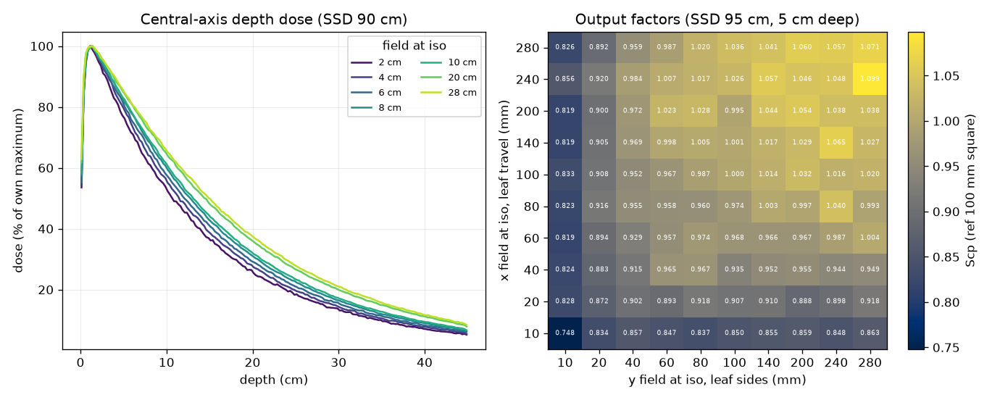

# Getting started

## Install

```bash
pip install pyRadMC              # reference backend; NumPy and SciPy only
pip install "pyRadMC[warp]"      # production backend, CPU and CUDA
pip install "pyRadMC[ct]"        # CT image reading (SimpleITK)
```

Warp is CUDA-only for GPU. The core install has no GPU dependency at all: `import
pyradmc` pulls in no third-party module, so a machine with neither warp nor a GPU can
still use the reference engine.

## A first dose calculation

```python
from pyradmc import AnalyticCrossSections, HostRNG, PencilBeamSource, ReferenceEngine, VoxelGrid

grid = VoxelGrid.uniform_water(shape=(16, 16, 16), spacing=(1.0, 1.0, 1.0))
xs = AnalyticCrossSections(geometry_densities=grid.max_density_by_material())
source = PencilBeamSource(energy=6.0, position=(8.0, 8.0, -1.0), direction=(0.0, 0.0, 1.0))

result = ReferenceEngine(grid=grid, cross_sections=xs, rng=HostRNG()).run(
    source, n_histories=80_000, n_batches=10, seed=20260726
)
```

`result.dose` is per-voxel dose in MeV/g **per emitted history**; multiply by
`pyradmc.GY_PER_MEV_PER_G` and your own particles-per-MU scaling for Gy.
`result.dose_sigma` is the batched 1-sigma standard error — batches exist so that
uncertainty is *measured*, not modelled.

### Check the energy books

Every run closes an exact ledger:

```python
assert abs(
    result.energy_emitted
    - (result.energy_deposited + result.energy_unscored + result.energy_escaped)
) < 1e-9 * result.energy_emitted
```

This is bookkeeping, not an estimate. If it does not close, the engine is broken — it is
the cheapest sanity check available, and worth keeping in your own scripts.

### Know what produced your numbers

```python
print(result.provenance.summary())
# pyradmc 0.2.0 ref/cpu seed=20260726 pcut=0.05 ecut=0.2 msc=gs step=0.2 xs=[analytic ...]
```

A dose array outlives the process that made it. `result.provenance` records the version,
backend, device, seed, cutoffs, multiple-scattering model, resolved substep fraction and
the cross-section citation, so an archived result still says how it was produced.

## Running on the GPU

```python
from pyradmc import WarpEngine

engine = WarpEngine(grid=grid, cross_sections=xs, device="cuda:0")
result = engine.run(
    source,
    n_histories=8_000_000,
    n_batches=10,
    seed=20260726,
    concurrent_batches=2,
)
```

On CUDA, `concurrent_batches` can overlap independent statistical batches when one
transport stream does not fill the card. Try 1, 2, and 4 on the actual workload;
each lane owns another queue set and dose map, so memory grows approximately linearly.
The batch fold remains ordered, making the lane count bitwise inert on one device.
CPU and the reference engine accept the option but run sequentially. An exact
`TransmissionMaskSource(SpectralBeamSource(...))` composition is generated and
masked on-device, including compaction of exactly-zero mask weights.

The `run` signatures are identical between backends, so swapping the backend is a
one-line change. Results agree statistically across targets, never bit-for-bit: compare
with a chi-squared test, not `assert_allclose`.

## The influence matrix

This is what the engine is for.

```python
from pyradmc import BeamletGridSource

source = BeamletGridSource(
    energy=6.0, z=-1.0, x_range=(0.0, 10.0), y_range=(0.0, 10.0), n_x=10, n_y=10
)
dij = engine.run_dij(source, n_histories_per_beamlet=200_000, n_batches=10, seed=20260726)

matrix = dij.dose_csc()      # scipy CSC, (n_voxels, n_beamlets)
plan_dose = matrix @ weights # the loop an optimizer runs thousands of times
```

!!! danger "Do not combine column sigmas in quadrature"

    Correlated sampling is the shipped default: beamlet columns share random streams and
    are therefore statistically **dependent**. Per-column sigmas remain valid on their
    own — per-beamlet QA is unaffected — but summing across columns to get a plan-dose
    sigma is invalid. `dij.variance_csc()` exports per-column variance and warns about
    exactly this. A per-batch plan-dose sigma is a known gap.

## Pencil-beam kernels

A mono-energetic pencil-beam kernel is the dose an infinitely narrow beam deposits in a
homogeneous medium, binned by depth and by radius about the beam axis. Bin dose in
cylindrical shells instead of voxels by handing `run` a `CylindricalScoringGrid`:

```python
from pyradmc import (
    CylindricalScoringGrid, PencilBeamSource, geometric_edges, graded_edges,
)

grid = VoxelGrid.uniform_water(shape=(64, 64, 50), spacing=(0.25, 0.25, 0.2))
cylinder = CylindricalScoringGrid.for_grid(
    grid,
    # Equal-ratio shells resolve the near-axis gradient; graded depth bins spend
    # resolution on the build-up and coarsen through the flat tail.
    radial_edges=geometric_edges(r_max=6.0, n_shells=28, r_min=0.05),
    depth_edges=graded_edges([(0.0, 2.0, 0.05), (2.0, 10.0, 0.25)]),
)
source = PencilBeamSource(energy=6.0, position=(8.0, 8.0, -0.1), direction=(0.0, 0.0, 1.0))

result = engine.run(source, n_histories=200_000, n_batches=10, seed=20260726,
                    scoring_grid=cylinder)

result.dose          # (n_depth, n_shells), MeV/g per history
result.dose_sigma    # per-shell 1 sigma, from the same batch statistics as always
cylinder.depth_centers, cylinder.radial_centers   # the abscissae to plot against
```

The same call runs on the reference, Warp CPU and Warp CUDA backends. Shells are cheap
statistically: each averages over the whole azimuth, so a kernel resolves at history
counts a Cartesian grid would need orders more for.

!!! warning "Scoring below the transport voxel needs `deposit_resolution_cm`"

    A condensed-history substep is capped at the transport voxel face, and its
    collision loss is filed at the half-step midpoint. Once steps are longer than a
    voxel — above roughly 2 MeV at 0.25 cm voxels — every deposit lands near the
    voxel centre, and a dose profile binned *below* the voxel picks up a large
    modulation at the voxel pitch (78 % peak-to-trough at 6 MeV).

    Pass `deposit_resolution_cm=cylinder.deposit_resolution_cm` to file each
    half-step in pieces that fine instead. It moves energy only *within* a voxel, so
    nothing scored at voxel resolution changes; it costs roughly 1.4x to 2x. Leave
    it off when your dose grid is the transport grid.

    Take the value from the scoring geometry rather than picking one. It must
    **divide** the bin widths: deposits sit at a fixed spacing from the step start
    and step starts are pinned to voxel faces, so a spacing that does not divide the
    bin aliases against it at a fixed phase, leaving a standing ripple. Over 0.025 cm
    bins at 15 MeV, a 0.010 cm spacing leaves 12.7 % peak-to-trough where 0.005 cm
    leaves 1.7 %.

!!! note "The cylinder is scoring, not geometry"

    Transport still runs on the rectilinear `VoxelGrid` — the phantom is a water **box**
    that surrounds the binned cylinder, which is also what keeps the outermost shell under
    full lateral scatter conditions. Nothing about the physics changes when you choose
    this binning; deposits landing in the box but outside the shells are booked to
    `result.energy_unscored`, so the energy ledger stays exact.

    Per-shell mass is the analytic annulus volume, which is exact only in a uniform
    medium. `for_grid` refuses a region the phantom does not cover or does not fill
    uniformly — use `ScoringGrid` for a heterogeneous phantom.

Electron primaries work through `primary_kind="electron"`, which exists for validating
electron transport against published ranges. Electron beams as a clinical modality are
out of scope.

`examples/pencil_kernel_demo.py` runs both and saves a figure.
`examples/pencil_kernel_database.py` sweeps an energy series into a single `.npz`
kernel table, and reports the achieved statistics per dose band.

## Better cross-sections

The analytic parameterization is correct to a few percent and needs no data files. For
accuracy work, compile the tabulated backend from the IAEA EPICS evaluations — see
[cross-section data](data.md).

## The examples

Each script under `examples/` runs a small but physically meaningful problem and saves a
figure beside itself that a physicist can sanity-check at a glance. They need the
`examples` extra (matplotlib) and each runs in well under a minute:
`reference_engine_demo.py` (scatter buildup against the primary-only exponential),
`electron_transport_demo.py` (buildup vs the KERMA approximation, R50 tracking the CSDA
range), `warp_backend_demo.py` (one physics source compiled three ways),
`dij_demo.py` (a beamlet column, the fluence-sum identity, a wedge plan as
`Dij @ weights`), `tabulated_demo.py` (EPDL/EEDL cross-sections), `materials_demo.py`
(bone/lung heterogeneity), `ct_demo.py` (dose on a CT), `dose_grid_demo.py` (decoupled
scoring grid and dose-to-water), `spectral_source_demo.py` (6 MV polyenergetic fan),
`collimation_demo.py` (staircase MLC field), `virtual_source_demo.py`
(measured-primary-fluence source model), `phasespace_demo.py` (IAEA phase-space source),
`custom_source_demo.py`, `pencil_kernel_demo.py` and `pencil_kernel_database.py`
(see [pencil-beam kernels](#pencil-beam-kernels)), and `noise_bias_study.py`
(the correlated-sampling decision study).

### The commissioning example



`commissioning_vsm_example.py` runs a full beam-data commissioning session: a water phantom
at a stated SSD, square fields, and the outputs a commissioning report carries — depth doses
with dmax and PDD(10), lateral profiles in both principal directions at five depths, diagonals
of the largest field, field widths and penumbrae, and a rectangular x-by-y output-factor
matrix. Every error bar is the spread of independent replicates, so the nonlinear quantities
carry one too. It is a [jupytext](https://jupytext.readthedocs.io/) percent notebook — open it
as a notebook or run it as a script; the whole configuration is the parameters cell at the top.

The head is **jawless with two stacked, staggered MLC layers** (29 and 28 leaf pairs of 1 cm
projected pitch, offset by half of it), built from published data about the Varian Halcyon and
driven by an unflattened beam. Leaf ends make the inplane edge and leaf *sides* make the
crossplane one, so a symmetric field steps in 1 cm even though each edge lands on a 0.5 cm
lattice. That machine was chosen because it leaves the collimator doing everything, with no
jaw to hide behind. Two results it establishes: field widths reproduce to within 0.1 mm at the
isocentre with **no fitted leaf-position offset**, from the rounded-end tangent geometry plus a
solved radiation-edge correction (the tangent ray grazes the tip, so it marks full transmission
rather than the 50 % edge — worth under 0.02 mm below a 10 x 10 field and 0.84 mm at 28 x 28);
and on an unflattened beam the field edge must be taken at the profile's **inflection point**
rather than at 50 % of the axis, because the classical construction reports a 40 mm penumbra
that describes the cone rather than the collimator.

**The source comes one of two ways.** By default it is the analytic model built in the notebook
— a spectrum, a focal spot, a radial fluence, an extra-focal term and a contaminant-electron
term — and needs no external data; most of that machine's geometry is unpublished, so the
opening cell is an explicit inventory of what is stated, fitted, bounded or invented, and the
fitted off-axis fluence table does *not* ship because it is derived from vendor measurements
(`PRIMARY_FLUENCE_FILE` is the hook for one you fit against your own). Point `PHASESPACE` at an
IAEA pair instead — or set `HALCYON_VSM_PHASESPACE` in the environment and run it unedited —
and the whole source model arrives already sampled in the particles, leaving the notebook to
supply only the collimator. That is the interesting comparison: a virtual source model fitted
through some other code's simplified collimator, pushed through an explicit one. Before
transporting anything that route rebuilds the model's *stated* spectrum and refuses the file if
the records disagree by more than 50 keV in on-axis mean energy, because a phase space that
contradicts its own documentation is a wasted run at best — a check that has already earned its
place. No phase space ships with the repository.

## Where to go next

- [Validation status](validation.md) — what has actually been gated, and against what.
- [API reference](api.md) — the supported surface.
